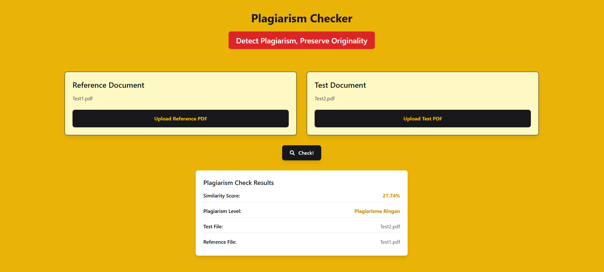

<h1 align="center">Plagiarism Checker</h1>


## Table of Contents
- [Description](#description)
- [Tech Stack](#tech-stack)
- [Structure](#structure)
- [Getting Started](#getting-started)

## Description
Plagiarism Checker is a powerful tool designed to detect plagiarism by comparing two documents using the **Cosine Similarity** algorithm. Users can upload a reference document and a test document, both in **PDF** format, and the tool will calculate the similarity score between them. The result includes a detailed plagiarism level, providing insights into how much of the content overlaps. This tool is ideal for students, researchers, and professionals who need to ensure the originality of their work.

## Tech Stack
- **Frontend**: Built with **Vite**, **React**, and **Tailwind CSS** for a fast, responsive, and modern user interface.
- **Backend**: Powered by **Flask (Python)**, utilizing Cosine Similarity for plagiarism detection.

## Structure
```
├── src/
│   ├── client
│   └── server
├── test/
|   ├── referensi
|   └── uji
└── README.md
```

## Getting Started
1. **Clone this repository:**
   ```bash
   git clone https://github.com/carllix/Plagiarism-Checker.git
   ```
2. **Navigate to the src directory of the program by running the following command in the terminal:**
   ```bash
   cd Plagiarism-Checker
   ```

### Run Server
1. **Navigate to the src/server by running the following command in the terminal:**
   ```bash
   cd src/server
   ```
2. **Create a virtual environment using the following command:**
    ```bash
   python -m venv venv
   ```
3. **Activate the environment**

    **For Windows:**
    ```bash
    venv\Scripts\activate
    ```
   **For MacOS/Linux:**
    ```bash
    source venv/bin/activate
    ```
4. **Install the required dependencies for the program by running:**
   ```bash
   pip install -r requirements.txt
   ```
5. **Run server using the following command:**
    ```bash
   flask run --debug
   ```
### Run Client/Website
1. **Open new terminal and navigate to the src/client by running the following command in the terminal:**
   ```bash
   cd src/client
   ```
2. **Install dependencies:**
    ```bash
   npm install
   ```
3. **Run the development server:**
    ```bash
   npm run dev
   ```
   You can access the website via `http://localhost:5173` in your web browser.